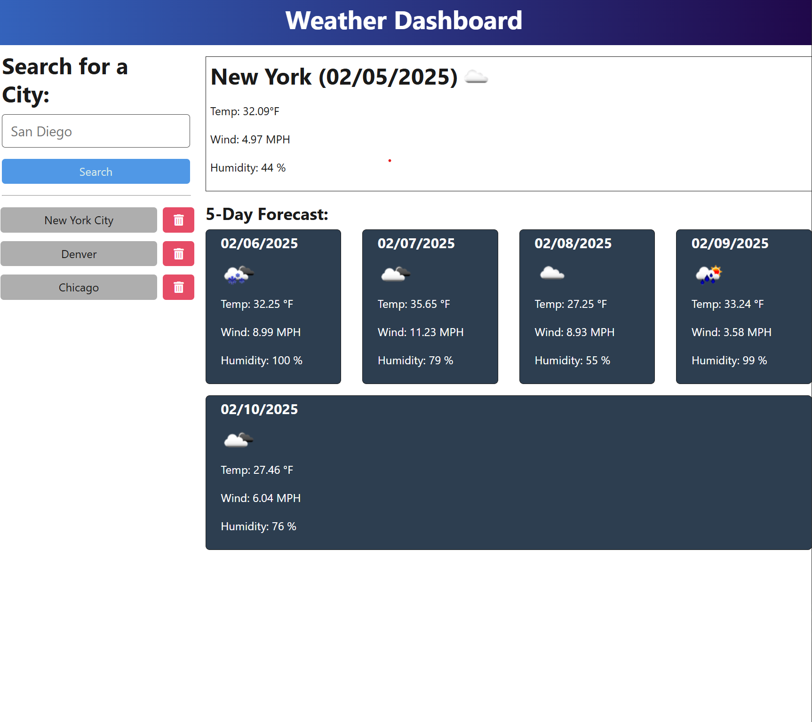

# Weather Dashboard

## Description
The **Weather Dashboard** is a web application that allows users to search for the weather outlook of multiple cities using the OpenWeather API. The application retrieves and displays current and future weather conditions to help travelers plan their trips accordingly.

## User Story
AS A traveler I WANT to see the weather outlook for multiple cities SO THAT I can plan a trip accordingly

## Features
- **Search Functionality:** Users can search for a city to retrieve weather data.
- **Current Weather Conditions:** Displays the city name, date, weather icon, weather description, temperature, humidity, and wind speed.
- **5-Day Forecast:** Shows a 5-day weather forecast, including the date, weather icon, temperature, wind speed, and humidity.
- **Search History:** Previously searched cities are saved and can be deleted from your history.
- **Responsive Design:** The application is designed to be fully responsive and user-friendly.

## Future Enhancements
- Refine logic for populating data for previously searched cities. 
- Add geolocation functionality to fetch weather for the user’s current location.
- Implement dark mode for better accessibility.
- Include additional weather data such as sunrise and sunset times.
- Improve search suggestions and autocomplete.

## Screenshots & Video Reference

## Deployment
Deployed via [Render](https://weather-dashboard-api-deployed.onrender.com)

## Technologies Used
- **HTML, CSS, JavaScript** – For building the front-end user interface
- **Bootstrap or Tailwind CSS** – For styling and layout
- **OpenWeather API** – To fetch weather data
- **Local Storage** – To store search history
- **Render** – For deployment

## Installation & Usage
### 1. Clone the Repository
### 2. Install Dependencies
### 3. Set Up API Key
### 4. Run the Application

## API Reference
Take not that this application uses the 5-day weather forecast API from OpenWeather:
https://api.openweathermap.org/data/2.5/forecast?lat={lat}&lon={lon}&appid={API key}

## License
This project is licensed under the MIT License. 

## Credit
A huge thank you to classmates, tutors, and TAs for helping me when I got stuck! 

## Contact
Reach out to Parker for any suggestions or questions:
[Github](https://github.com/sunny-script)